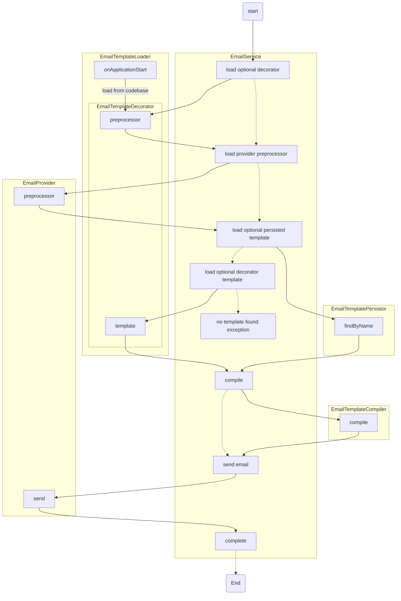

# Email sending and Templating

## Send email using template

To send an email using a template, use its type and provide the variables that the template requires.

```typescript
import { EmailService } from '~common/email';

export class MyService {
  constructor(private readonly emailService: EmailService) {}
  async sendEmail() {
    await this.emailService.sendTemplate(
      {
        to: 'user@email.com'
      },
      'FORGOT_PASSWORD',
      {
        frontendUrl: 'http://localhost:3000',
        code: '123456',
        expireAt: new Date(),
      },
    );
  }
}
```

## Config Example

```yaml
email:
  # Default Sender
  defaultFrom: Info Example <info@example.com>
```

```typescript
@Module({
  imports: [
    // Emails
    EmailModule.forRoot([AwsSesEmailModule, PrismaEmailTemplateModule]),
  ]
})
export class AppModule {}
```

## Coded templates

Templates can be defined just in the database or using the `EmailTemplate` decorator that will provide the default
template and optional preprocessor.

### Template example

```typescript
export class ForgotPasswordEmailTemplateParameters {
  @Expose()
  @IsString()
  frontendUrl!: string;

  @Expose()
  @IsString()
  code!: string;

  @Expose()
  @IsDate()
  expireAt!: Date;
}

export const ForgotPasswordDefaultEmailTemplate: IEmailTemplate = {
  name: 'AUTHN_PASSWORD_RESET',
  subject: 'Forgot Password',
  engine: 'html',
  html: `
    <p>Click <a href="{{frontendUrl}}/reset-password?code={{code}}">here</a> to reset your password.</p>
    <p>This link will expire at {{expireAt}}</p>
  `,
  text: `
    Click here to reset your password: {{frontendUrl}}/reset-password?code={{code}}
    This link will expire at {{expireAt}}
  `,
};

@Injectable()
export class AuthnEmailTemplate {
  constructor() {}

  @RegisterEmailTemplate({
    validate: ForgotPasswordEmailTemplateParameters,
    template: ForgotPasswordDefaultEmailTemplate,
  })
  passwordReset(data: IEmailData<ForgotPasswordEmailTemplateParameters>) {
    // This is a preprocessor that can modify the data before sending the email
    return data;
  }
}
```
### Using coded templates

```typescript
await this.emailService.sendTemplate<ForgotPasswordEmailTemplate>({ to: user.email }, ForgotPasswordDefaultEmailTemplate.name, {
  frontendUrl,
  code,
  expireAt,
});
```

## Escape hatches

Along with setting custom recipients and destinations, you can also provide a custom template that will not be overridden.

```typescript
await this.emailService.sendTemplate<ForgotPasswordEmailTemplate>({ to: user.email }, FORGOT_PASSWORD_EMAIL_TEMPLATE, {}, {
    template: {
      subject: 'Did you forget your password?',
      html: `<p>Go to {{frontendUrl}}/reset-password?code={{code}} to reset your password.</p>`
    },
  }
);
```

or directly provide the subject and html, but for this case, use the `send` method instead.

```typescript
await this.emailService.send({ to: user.email, subject: 'A title', content: 'Email content'});
```

> Note: Changing senders needs to be aligned with the provider send permissions for that address.

## Architecture



## MJML Support

Install packages

```bash
yarn add mjml@^4.15.3 @types/mjml@^4.7.4
```

Edit the template compiler at `./email-template-compiler.ts`:

```typescript

import { EmailPreprocessorError } from './email.exceptions';

@Injectable()
export class EmailTemplateCompiler {

  public async compile() {
    // ...
    if (template.engine.startsWith('mjml')) {
      if (html) {
        try {
          /**
           * @see https://github.com/mjmlio/mjml
           */
          const { default: mjml2html } = await import('mjml');
          const result = mjml2html(html, {
            keepComments: false,
            minify: true,
            validationLevel: 'soft',

            // do not use includes
            ignoreIncludes: true,
          });
          if (result.errors.length) {
            throw new EmailPreprocessorError('Template Render Failed', {
              details: { errors: result.errors, data, template },
            });
          }
          html = result.html;
        } catch (error) {
          if (error instanceof EmailPreprocessorError) {
            throw error;
          }
          throw new EmailPreprocessorError('Template Failed', { cause: error, details: { data, template } });
        }
      }
    }
    // ...
  }
  // ...
}
```

enhancement: scaffold
