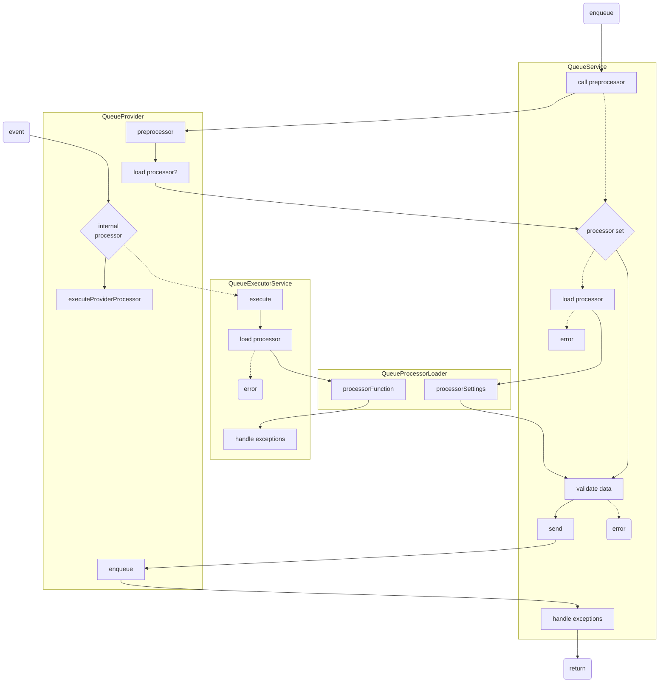

# Queue

Run long-running tasks in the background over several instances.

## Example usage


### Enqueue a job
```typescript
import { Injectable } from '@nestjs/common';
import { QueueService } from '~common/queues/queue.service';

@Injectable()
export class MyConsumerService {
  constructor(
    private readonly queueService: QueueService,
  ) {}
  async startJob(): Promise<Job<MyProcessorData>> {
    const job = await this.queueService.enqueue('my-processor', { id: makeUUID() });
  }
}
```

### Register a processor
```typescript
import { Injectable } from '@nestjs/common';
import { RegisterProcessor } from '~common/queues';

export class MyProcessorData {
  @Expose()
  @IsString()
  readonly id!: string;
}

@Injectable()
export class MyService {
  constructor() {}

  @RegisterProcessor('my-processor', { timeout: 60, validate: MyProcessorData })
  async myProcessor(job: Job<MyProcessorData>): Promise<{ message: string }> {
    // do work until job.context.timeout seconds have passed
    return { message: 'done' };
  }
}
```

### Setup

```typescript
@Module({
  imports: [
    QueueModule.forRoot([HotwireQueueModule]),
  ]
})
export class AppModule {}
```

> See ./providers for provider specific configuration.

## Architecture


